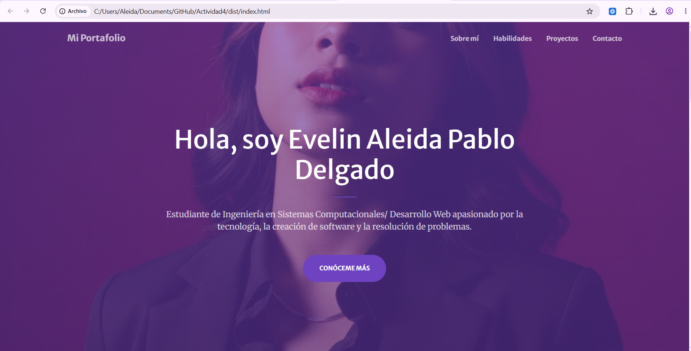

# Portafolio Personal - Actividad Web

**Nombre del estudiante:** Evelin Aleida Pablo Delgado  
**Modalidad:** Individual  
**Materia:** Programación Web  

---

## Descripción del Proyecto
Este proyecto es un portafolio web funcional y responsivo desarrollado con **HTML, CSS y JavaScript**, utilizando como base de diseño el framework **Bootstrap 5** a través de la plantilla **Creative** de Start Bootstrap.

* **Framework CSS utilizado:** Bootstrap v5.2.3
* **Plantilla Base:** Creative por Start Bootstrap
* **Link de descarga de la plantilla original:** [Start Bootstrap - Creative](https://startbootstrap.com/theme/creative)

# Portafolio Personal - Actividad Web

## Secciones del Portafolio

1. **Inicio:** Encabezado con un mensaje de bienvenida, un título descriptivo y un botón de llamada a la acción hacia la siguiente sección.
2. **Sobre mí:** Contiene información personal sobre mi perfil académico, aspiraciones y una **foto de perfil real y formal** tomada en un entorno profesional.
3. **Habilidades (Skills):** Cuadrícula representativa con las principales tecnologías e iconos (HTML5, CSS3, JavaScript, Git y Bases de Datos) que estoy aprendiendo y domino.
4. **Proyectos:** Galería interactiva con imágenes que destacan proyectos planificados o en desarrollo (Sistemas de Inventario, Apps de Base de Datos de la plataforma Mindbox, E-commerce).
5. **Contacto:** Formulario dinámico con campos para nombre, correo y mensaje, preparado para recepción de consultas.

---

## Proceso de Creación Paso a Paso

1. **Elección y descarga de la plantilla:** Se eligió la plantilla de Bootstrap *Creative*.
2. **Estructuración del proyecto:** Se crearon las carpetas `css/`, `js/` e `img/` para mantener una arquitectura limpia de proyecto.
3. **Adaptación de contenidos:**
   * Se reemplazaron los textos predeterminados de la plantilla por información propia.
   * Se ajustó la sección de *About* para incluir la foto de perfil real y profesional.
   * Se configuraron las habilidades requeridas y proyectos deseados/planeados para completar el perfil.
4. **Modificación de CSS y JS:** Se crearon los archivos `css/portafolio.css` y `js/portafolio.js` separando los scripts e incluyendo estilos personalizados para el manejo de la imagen de perfil y validaciones sencillas.
5. **Despliegue:** Se publicó el repositorio público en GitHub y se habilitó la opción de **GitHub Pages**.

---

## Capturas de Pantalla

---

## Enlaces de Entrega

* **Repositorio de GitHub:** `https://github.com/AleidaPablo/Actividad4.git`
* **Sitio publicado en GitHub Pages:** `https://aleidapablo.github.io/Actividad4/`
---

